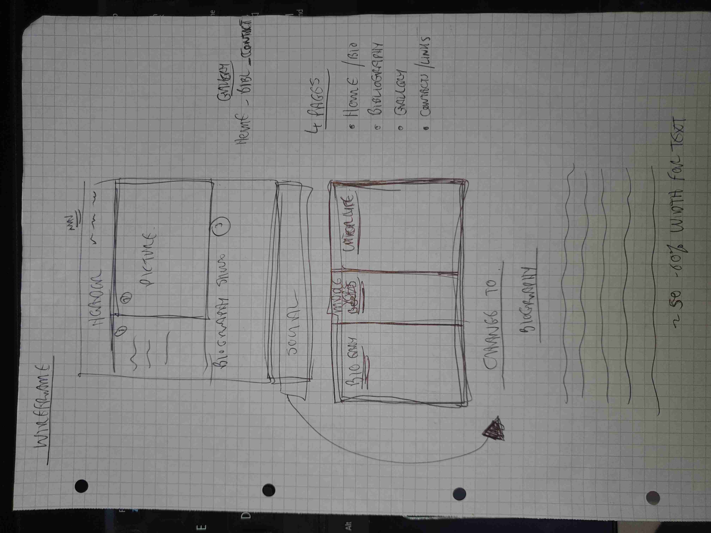
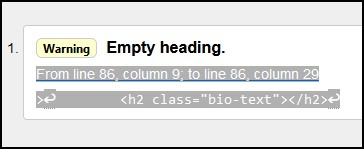

# Oliver St John Gogarty
## A website to outline a brief biography of a remarkable Dublin literary figure

I wanted to create a historical website to give some basic biograpical information, pictures, bibliography etc. of a write that I have an interest in.

View the live project here : [Oliver St. John Gogarty](https://conorjbr.github.io/Oliver-St-John-Gogarty/)

## General design of site 

I chose a very basic design concept with a plain light grey background and charcoal coloured text.  Most of the font is Verdana as I lik e the clean look of this font.
I decided that 4 pages would be enough to give a brief outlien of this person's life and achievements. I was conscious of adding a lot of text to the biography section and didn't want to overload the reader with too much reading material.

I did some rough wireframe sketches of the proposed site layout before commencing mt html coding and this was a very useful exercise to do.  I did not use any wireframe creation sofwarw as I felt that the site structure was simple and my sketches were sufficient.  See sketches below.

### Hero Image
I chose a hero image which is an oil-painting of the website subject which awas also painted by another famous artist, William Orpen.  I felt this gave an artistic and aesthetic effect to the reader on first opening the site and I feel this is a very good portrait.  I also liked the colour contrast with the light grey background.

Hero Image

## Features

### Navigation Bar

I added a navigation bar using an unordered list from to create the four links required as follows ;
- Home
- Bibliography
- Gallery
- Contact (& links)

### Footer section

I included a basic footer bar with links to social media sites for users to further interact with other interested persons.  This was based on the aproach as demonstrated in the "Love-Running" project and icons were taken from fontawesome.com.

### Landing page image

As noted above I felt that this was an aesthetically pleasing, artisitc and interesting image for the user to begin their interactoin with the site. 

### Bio section

There was a lot of information available for this section and the challenge here was to try to condense this into a suitable lenth passage so as not to put off prospective reader.  Oliver St. John Gogarty led a very full life as the reader will note.  I mainly used content from Wikipedia here and I deleted lot of information in order to make the piece more readable.  I feel that there id probably still too much information here and would add another page to hold the biographical details if I were developing the site further.

### Bibliography

Added as a simple list. I felt that this was a very important aspect of the site and one that would be very interesting due to the subject's prolific output.

### Gallery

Again I wanted to add this to give the site a bit more aesthetic appeal.

### Contact form

I mainly used the css styling from the love running project in order to create the main elements of this form.  The form takes a very simple design approach and is currently not linked to a database to receive posted user information.

### Useful links

Added as simple list for users to explore the subject further.

### Audio clip

This is a very interesting interview which was made in 1949.  I feel that its inclusion adds a lot of interest to the site.

## Testing

### Validator Testing

###### HTML tested with [W3C markup validation service](https://validator.w3.org/)

###### CSS tested with [W3C CSS validation service](https://jigsaw.w3.org/css-validator/validator)

- HTML 
  - index.html
    - Section closing tag missing - tag added to resolve issue.
    - Body closing tag missing - tag added to resolve issue.
    - After completion of the above steps the following message was shown "Document checking completed. No errors or warnings to show."

  - bibliography.html
    - figcaption error noted, figure element added around figcaption to resolve issue.
    - Section closing tag missing - tag added to resolve issue.
    - Div closing tag missing - tag added to resolve issue.
    - After completion of the above steps the following message was shown "Document checking completed. No errors or warnings to show."

  - gallery.html
    - ul duplicate element noted - tag removed to resolve issue
    - a element  closing tag missing - added to resolve issue
    - section lacks header noted - added h2 element to resolve as adding div messes up the gallery format.
    - After completion of the above steps the following message was shown "Document checking completed. No errors or warnings to show."

  - contact.html
    - ul duplicate element noted - tag removed to resolve issue
    - a & li elements  closing tag missing - added to resolve issue
    - section lacks header noted - added h2 element to resolve but this creates another problem as follows ;
       
       

    I tried to add heading text to this and set opacity to 0 as I don't really need a h2 element here.  Decided not to try to resolve this further as code is functioning correctly.
    - audio element closing tag missing - added to resolve.
    - audio file, bad value noted due to spaces in audio filename.  Renamed file in my assets folder and also in the html tag to resolve this.  Checked audio player and is working correctly.
  
  - style.css
  

- CSS
  - Congratulations! No Error Found.
  - 
  
  - One warning noted as follows "Imported style sheets are not checked in direct input and file upload modes"
  

### Unfixed Bugs

As noted above in the html validator section, I decided not to resolve the "Empty Heading" warning in the contact.html page.  If I had more time I would rewrite my html to eliminate this error.

## Deployment

The site was deployed to GitHub pages. The steps to deploy are as follows:
In the GitHub repository, navigate to the Settings tab
From the source section drop-down menu, select the Master Branch
Once the master branch has been selected, the page will be automatically refreshed with a detailed ribbon display to indicate the successful deployment.

The live link can be found here - https://conorjbr.github.io/Oliver-St-John-Gogarty/

## Credits

### Content

- [Wikipedia - Oliver St. John Gogarty](https://en.wikipedia.org/wiki/Oliver_St._John_Gogarty)
- [Dictionary of Irish Biography](https://www.dib.ie/index.php/biography/gogarty-oliver-st-john-a3513)

### Media

- [Libquotes](https://libquotes.com/oliver-st-john-gogarty)

- [10best.com](https://www.10best.com/destinations/ireland/dublin/dublin-2/nightlife/oliver-st-john-gogarty/)

- [Full Stop.net](https://www.full-stop.net/2012/08/13/features/essays/tyler-malone/a-stately-plump-bronze-medalist-john-gogarty-and-the-olympic-art-competitions/)

- [Irish America.com](https://www.irishamerica.com/2018/11/oliver-st-john-gogarty/)

### Code
- [W3 schools](https://www.w3schools.com/)

- [Love running project](https://learn.codeinstitute.net/courses/course-v1:CodeInstitute+LR101+2021_T1/courseware/4a07c57382724cfda5834497317f24d5/f2db5fd401004fccb43b01a6066a5333/)

- [coder coder !](https://coder-coder.com/)
- [freecodecamp](https://www.freecodecamp.org/)
- [Stack overflow](https://stackoverflow.com/questions/tagged/cs)
- [Mozilla MDN web docs](https://developer.mozilla.org/en-US/docs/Web/CSS/overflow)
- Mentor, Harry Dhillon 
- Code institute alumni and students (via Slack chat) 
- Code Institute tutoring service

## Responsiveness

I checked the URL in the "Am I Responsive" tool at [Am I responsive](https://ui.dev/amiresponsive?url=https://conorjbr.github.io/Oliver-St-John-Gogarty/),

See results below.

This checks the website responsiveness at the following screen sizes
Desktop
    1600x992px scaled down to scale(0.3181)
Laptop
    1280x802px scaled down to scale(0.277)
Tablet
    768x1024px scaled down to scale(0.219)
Mobile
    320x480px scaled down to scale(0.219)

Overall the responsiveness looked acceptable.  I also checked all pages and manipulated screen size with the DevTools to check this and found results generally acceptable.  If I had more time and skills, I would change nav menu to burger type in the smaller sizes.  I investigated how to do this but found that I had insufficient time to progress further with this.