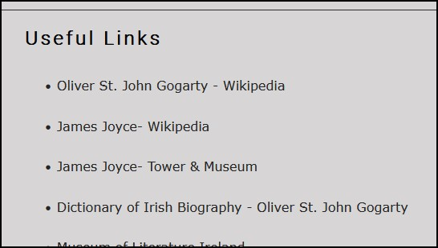

# Oliver St John Gogarty
## A website to outline a brief biography of a remarkable Dublin literary figure

I wanted to create a historical website to give some basic biograpical information, pictures, bibliography etc. of a writer and historical period in which I have an interest.

View the live project here : [Oliver St. John Gogarty](https://conorjbr.github.io/Oliver-St-John-Gogarty/)

## General design of site 

I chose a very basic design concept with a plain light grey background and charcoal coloured text.  Most of the font is Verdana as I like the clean look of this font.  
I decided that 4 pages would be enough to give a brief outline of this person's life and achievements.  I was conscious of adding a lot of text to the biography section and didn't want to overload the reader with too much reading material.

I did some rough wireframe sketches of the proposed site layout before commencing my html coding and this was a very useful exercise to do.  I did not use any wireframe creation sofware as I felt that the site structure was simple and my basic sketches were sufficient.  See sketches below.

## Responsiveness

I checked the URL in the "Am I Responsive" tool at [Am I responsive](https://ui.dev/amiresponsive?url=https://conorjbr.github.io/Oliver-St-John-Gogarty/),

See results below.

This checks the website responsiveness at the following screen sizes
Desktop
    1600x992px scaled down to scale(0.3181)
Laptop
    1280x802px scaled down to scale(0.277)
Tablet
    768x1024px scaled down to scale(0.219)
Mobile
    320x480px scaled down to scale(0.219)

Overall the responsiveness looked acceptable.  I also checked all pages and manipulated screen size with the DevTools to check this and found results generally acceptable.  If I had more time and skills, I would change nav menu to burger type in the smaller sizes.  I investigated how to do this but found that I had insufficient time to progress further with this.

## Features

### Hero Image

I chose a hero image which is an oil-painting of the website subject.  This was painted by the famous artist, Sir William Orpen.  I felt this image gives an artistic and aesthetic effect to the reader on first opening the site and I feel this is a very pleasing portrait.  I also liked the colour contrast with the light grey background.

### Navigation Bar

I added a navigation bar using an unordered list to create the four links required as follows ;
- Home
- Bibliography
- Gallery
- Contact (& links)

### Footer section

I included a simple footer bar with links to social media sites for users to further interact with other interested persons.  

### Landing page image

As noted above I felt that this was an aesthetically pleasing, artistic and interesting image for the user to begin their interaction with the site. 

### Bio section

There was a lot of information available for this section and the challenge here was to try to condense this into a suitable length passage to give a sense of the subject but not to put off the prospective reader.  Oliver St. John Gogarty led a very full life as the reader will note.  I mainly used content from Wikipedia here and I deleted lot of the available information in order to make the piece shorter and more readable.  I feel that there is probably still too much information here and would add another page to hold the biographical details if I were developing the site further.

### Bibliography

Added as a simple list. I felt that this was a very important aspect of the site and one that would be of great interest to the reader due to the subject's prolific output.

### Gallery

I felt the site needed some aesthetic appeal. If time and ability allowed I would like to expand this page a lot further.

)

### Contact form

My form takes a very simple design approach and is currently not linked to a database to receive the user-posted information.

### Useful links

Added as a simple list of clickable links for users to explore the subject further.

### Audio clip

This is an interesting interview which was recorded in 1949.  I feel that its inclusion adds interest to the site.

## Testing

### Validator Testing

###### HTML tested with [W3C markup validation service](https://validator.w3.org/)

###### CSS tested with [W3C CSS validation service](https://jigsaw.w3.org/css-validator/)

- HTML 
  - Index.html
    - Section closing tag missing - tag added to resolve issue.
    - Body closing tag missing - tag added to resolve issue.
    - After completion of the above steps the following message was shown *"Document checking completed. No errors or warnings to show."*

  - Bibliography.html
    - figcaption error noted, figure element added to wrap around figcaption to resolve issue.
    - Section closing tag missing - tag added to resolve issue.
    - Div closing tag missing - tag added to resolve issue.
    - After completion of the above steps the following message was shown *"Document checking completed. No errors or warnings to show."*

  - Gallery.html
    - ul duplicate element noted - tag removed to resolve issue
    - a element  closing tag missing - added to resolve issue
    - section lacks header noted - added h2 element to resolve as adding div messes up the gallery format.
    - After completion of the above steps the following message was shown *"Document checking completed. No errors or warnings to show."*

  - Contact.html
    - ul duplicate element noted - tag removed to resolve issue
    - a & li elements  closing tag missing - added to resolve issue
    - section lacks header noted - added h2 element to resolve but this creates another problem as follows ;
       
       

        I tried to add heading text to this and set opacity to 0 as I don't really need a h2 element here.  Decided not to try to resolve this further as code is functioning correctly.
    - audio element closing tag missing - added to resolve.
    - audio file, bad value noted due to spaces in audio filename.  Renamed file in my assets folder and also in the html tag to resolve this.  Checked audio player and audio is working correctly.
  
  - Style.css
    - *Congratulations! No Error Found.*
    - 
  
    - One warning noted as follows "Imported style sheets are not checked in direct input and file upload modes"
  

### Unfixed Bugs

As noted above in the html validator section, I decided not to resolve the "Empty Heading" warning in the contact.html page.  If I had more time I would rewrite my html to eliminate this error.

## Deployment

The live link can be found here - https://conorjbr.github.io/Oliver-St-John-Gogarty/

The site was deployed to GitHub pages. The steps to deploy are as follows:

* In the GitHub repository, navigate to the Settings tab
* From the source section drop-down menu, select the Master Branch
* Once the master branch has been selected, the page will be automatically refreshed with a detailed ribbon display to indicate the successful deployment.

The live link can be found here - https://conorjbr.github.io/Oliver-St-John-Gogarty/

The steps to copy / fork the code are as follows:

* In the GitHUb repository, click the "fork" tab at top right of page
* Check the fork name is correct
* Select an owner for the forked repository
* Edit the description if required
* Click on green "Create Fork" button at bottom of page

OR

* In the GitHUb repository, click the green "Code" tab at top of page
* Copy the URL for the repository.
* Open Git Bash.
* Change directories to the location of the fork you cloned.
* Type git remote -v and press Enter. You will see the current configured remote repository for your fork.
* Type git remote add upstream, and then paste the URL you copied 
* To verify the new upstream repository you have specified for your fork, type git remote -v again. You should see the URL for your fork as origin, and the URL for the upstream repository as upstream.

OR

* Download ZIP file
* Create a new repository using downloaded ZIP file.

## Credits

### Content

- [Wikipedia - Oliver St. John Gogarty](https://en.wikipedia.org/wiki/Oliver_St._John_Gogarty)
- [Dictionary of Irish Biography](https://www.dib.ie/index.php/biography/gogarty-oliver-st-john-a3513)

### Media

- [Libquotes](https://libquotes.com/oliver-st-john-gogarty)

- [10best.com](https://www.10best.com/destinations/ireland/dublin/dublin-2/nightlife/oliver-st-john-gogarty/)

- [Full Stop.net](https://www.full-stop.net/2012/08/13/features/essays/tyler-malone/a-stately-plump-bronze-medalist-john-gogarty-and-the-olympic-art-competitions/)

- [Irish America.com](https://www.irishamerica.com/2018/11/oliver-st-john-gogarty/)

### Code
- [W3 schools](https://www.w3schools.com/)  
  * Various tips and trick to get the css styling to work.

- [Love running project](https://learn.codeinstitute.net/courses/course-v1:CodeInstitute+LR101+2021_T1/courseware/4a07c57382724cfda5834497317f24d5/f2db5fd401004fccb43b01a6066a5333/)

   * Structure of navbar
   * Structure of footer
   * Structure of contact form

- [coder coder !](https://coder-coder.com/)

  * Organising divs and applying correct styling

- [freecodecamp](https://www.freecodecamp.org/)
  * Flex styling for side by side contact form and links

- [Stack overflow](https://stackoverflow.com/questions/tagged/cs)
  * Misc tips and tricks to make flex styling work.

- [Mozilla MDN web docs](https://developer.mozilla.org/en-US/docs/Web/CSS/overflow)
  * Working with firefox Dev Tools

- Code Institute Mentor, Harry Dhillon @Harry-Leepz

- Code institute alumni and students (via Slack chat) 

- Code Institute tutoring services

## Project Conclusions

I was amazed that I was actually able to complete this project as I wsa totally at sea at the start.  I have learned a lot about CSS and HTML in putting together this project and am keen to put this knowledge to further use.

### Learnings from this project
I have learned to apply te basics of html and css styling. This has ben more dificult than I thought it would be, particularly the CSS.
It appeared from the walk-through "Love-Running" project that things would come together quite esily once the main structure was in place.  This very nuch proved toi be not the case and I wa surprised at the amount of time the styling took.  I also was surprised at how much efforrt was required to get the responsiveness to work even as well as it does on my site, which is admittedly not perfect.  I have found a number of solutions to repeated issues such a s centring on a page etc. but I still find that positioning element is something I am ot fully comfortable with.

### Things I would do differently if starting again
* Engage with mentor earlier 
* Not put myself under time pressure ie start earlier.
* spend more time planning the styling.
* I would start with small screen size and work up to larger screens when setting up the responsiveness @media queries.  I did it by starting with large screen and this caused ma lot of issues with the smaller screen sizes.

### Future improvements to the site

* Improve the responsiveness at smaller sizes by adding burger menus etc.
* Add another page to expand out the biography section / remove bigraphy from home page altogether.
* Improve the gallery styling & add captions to all images.

## Acknowledgements & thanks

Thanks to tutors at code institute and my mentor Harry for their help with hetting this project done.  Also thanks to fellow code institite students and alumni who assisted me via slack messages and calls.
You are all a truly great bunch of people and I hope I can be helpful to other student s in the same way.